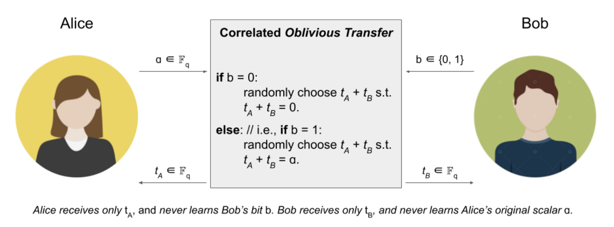
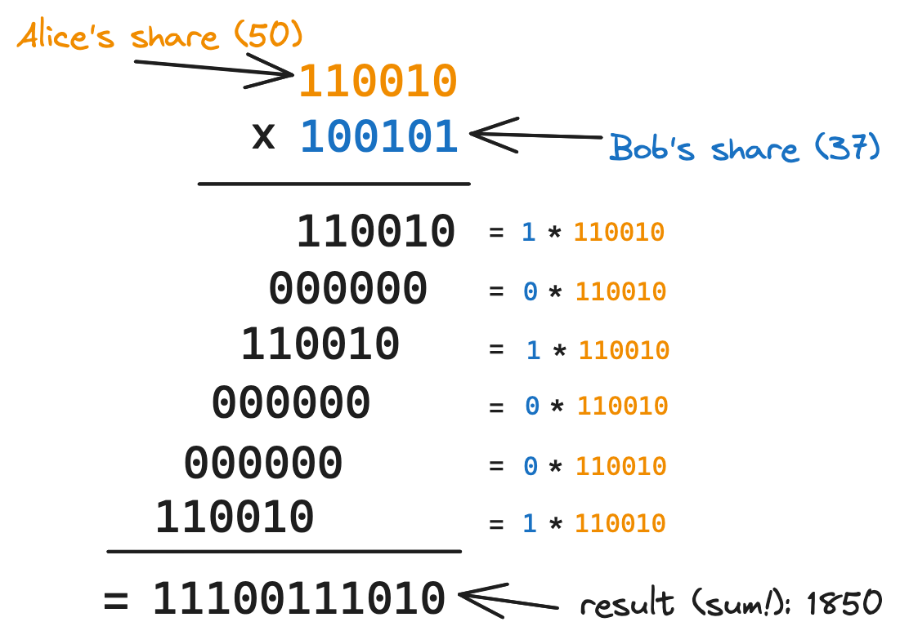

> [!IMPORTANT]  
> This repository is under active development. This notice will be removed once it's at a "v1" stage.

# dkls

This repository contains an implementation of [dkls18](https://eprint.iacr.org/2018/499), a multi-party protocol to compute ECDSA signatures.

## Installing

```
npm install
```

## Running tests

```
npm test
```

## Building

```
npm run build
```

## Motivations

Multi-Party Computation (MPC) seen from the outside looks like an obscure, complicated, dangerous art. For my own understanding I set a goal to implement at least one MPC protocol to crack open that black box and see for myself what's behind MPC.

I'm writing this in Typescript because there's no good existing package (that I know of) and I can think of fun applications if MPC protocols were available in browsers directly instead of being confined to the server side (there is an existing dkls implementations [in Go](https://github.com/coinbase/kryptology/tree/master/pkg/tecdsa/dkls), some MPC protocol implementations [in Rust](https://gitlab.com/thorchain/tss/multi-party-ecdsa-docker/-/tree/master/src/protocols?ref_type=heads), but overall: it's sparse!).

Why dkls18? Looking at what's implemented today, the world needs more concrete implementations and fewer papers. [GG18](https://eprint.iacr.org/2019/114.pdf), [GG20](https://eprint.iacr.org/2020/540), [Lindell 17](https://eprint.iacr.org/2017/552.pdf), [dkls18](https://eprint.iacr.org/2018/499)...none of these protocols have solid implementations across many languages. I happen to have a special relationship with dkls18: it's a paper I've been trying to read and understand for a while now. Implementing it would mean that I've finally made it. Without implementing it I can fool myself into thinking I understand it but we all know that severe gaps might still be there. I want to make sure there are no such gaps.

## Implementation philosophy

I'm here to learn and help others learn, hence **clarity** being of utmost importance. Clarity is also good for security, but the code here shouldn't be considered secure or production ready. I'm not planning to pay for an audit.

Another very important thing I'll try to do here is optimize for **correctness**. I want tests, I want confidence that it all works, and I want others to be convinced of the same.

That being said, if you are looking to use this for commercial purposes, please reach out especially if you are willing to pay for an audit. I'm more than happy to add references to audit reports in here so that others can benefit as well.

The [LICENSE](./LICENSE) I'm starting with is a permissive one: the honorable Apache 2.0 license. In other words: you may use this in pretty much any way you want as long as you properly do attribution. Also: I'm not liable for anything that happens should you choose to use this software.

## Intuition and main ideas in dkls

[dkls18](https://eprint.iacr.org/2018/499) is a complex paper. Let's start with intuition and ideas.

At its core, the protocol described in dkls allows 2 participants to collaborate on generating ECDSA signatures **without anyone knowing the associated private key**. This isn't like Shamir Secret Sharing (where the private key is **reconstructed** before signing) or Multisig (where multiple private keys exist). In MPC, the private key never exists fully in one place.

Reminder: an ECDSA signature is computed with the following steps:
* Pick a random $k$ (called "nonce")
* Compute the point $R = k*G$ (where $G$ is a generator)
* Compute $r = x \mod N$ (where $x$ is $R$'s x coordinate, and $N$ is the order of the group generated by $G$)
* Compute $s = k^{-1}*(H + r*d) \mod N$ (where $H$ is the hash of the message to sign, and $d$ is the secret key)
* The signature is $(r, s)$

To compute a new ECDSA signature, two private inputs are needed: $k$ (the nonce) and $d$ (the secret key), and _neither party can know their value_. So: how do we compute a signature? With **private shares of these inputs**. More specifically: multiplicative shares and additive shares. From now on we'll refer to the two parties as "Alice" and "Bob". The protocol has three main phases.

### Generate multiplicative shares of $k$ (nonce) and $s$ (secret key)

In this phase the protocol generates multiplicative shares. Alice generates $(k_a, s_a)$ and Bob generates $(k_b, s_b)$ such that $k_ak_b = k$ and $s_as_b = d$. And of course, neither of them know the full $k$ or $d$.

With these shares, Alice and Bob can compute:
* $H$ (message hash, no shares are needed for this)
* $R = (k_ak_b)G$ and $r = R_x \mod N$

### Transform multiplicative into additive shares

In this phase the participants **generate additive shares** of $k^{-1}$ and $dk^{-1}$.

In order to do this, Alice and Bob use a Multiplication-to-Addition protocol ("MtA", described further below). MtA is a primitive to let Alice and Bob transform **multiplicative** shares of a secret (input shares $s_a, s_b$ are such that $s_as_b = d$) into **additive** shares of that same secret (output shares $t_a, t_b$ will be such that $t_a+t_b = d$).

Alice and Bob compute $k_a^{-1}$ and $k_b^{-1}$ (they can do this independently), then use the MtA protocol to obtain $(k_{inva}, k_{invb})$ such that $k_{inva} + k_{invb} = k_a^{-1}k_b^{-1} = k^{-1}$

Now Alice and Bob use MtA with inputs $s_ak_a^{-1}$ and $s_bk_b^{-1}$, to obtain additive shares of the product ($s_ak_a^{-1} * s_bk_b^{-1} = sk^{-1}$). Let's call these additive shares $t_{sk_a}, t_{sk_b}$.

### Compute the signature shares

Now Alice and Bob can finally compute a signature, they have all the elements:
* Alice computes $sig_a = H*k_{inva} + r*t_{sk_a}$
* Bob computes $sig_b = H*k_{invb} + r*t_{sk_b}$

Note that these are additive shares of the $s$ component of our actual signature:

$ sig_a + sig_b
\\= H*k_{inva} + r*t_{sk_a} + H*k_{invb} + r*t_{sk_b}
\\= H*(k_{inva}+k_{invb}) + r*(t_{sk_a} + t_{sk_b})
\\= H*k^{-1} + r*sk^{-1}
\\= k^{-1}*(H + r*s)
\\ = s \qquad \blacksquare
$

$r$ was already computed in phase 1, so we're done! We have successfully computed $(r, s)$.

### Broadcast and verify

Finally Alice and Bob can broadcast these shares, add them together, and compute the final signature. And verification is needed to ensure the other participant did their share of the protocol faithfully.

## Multiplication-to-Addition protocol

The Multiplication-to-Addition protocol (MtA) is the crux of dkls. It's natural to wonder how it works. Remember, it takes multiplicative shares $s_a, s_b$ of a secret $s$ (such that $s_as_b = s$) and outputs 2 new random **additive** shares $t_a, t_b$ of the same secret (such that $t_at_b = s$).

MtA is based on correlated Oblivious Transfer (cOT):


_image taken from [this excellent blog post](https://www.coinbase.com/blog/fast-secure-2-of-2-ecdsa-using-dkls18) from Coinbase_

Note that this protocol is not _exactly_ what we need. In the picture above:
* Bob's input is a single bit ($b \in \set{0, 1}$) instead of a full blown share
* The output adds up to Alice's input or 0, depending on Bob's input. Instead, we'd like the two shares to add up to the sum of Alice and Bob's input, always.

To obtain a MtA protocol from cOT, we need to leverage an important idea: [long multiplication](https://en.wikipedia.org/wiki/Multiplication_algorithm#Long_multiplication). To make this more concrete, suppose that Alice and Bob share a secret number $s$: 1850. And suppose the multiplicative shares are $s_a = 50$ and $s_b = 37$.

Observe how long multiplication plays out:



To transform their multiplicative shares (0b110010 or 50, 0b100101 or 37) into two additive shares, Alice and Bob will run cOT 6 times:
* the first cOT takes 110010 (Alice's share) and Bob's share's right-most bit (1). The output will be 2 new random additive shares such that $t_{a_1}+t_{b_1} = 110010$.
* the second cOT takes Alice's share **shifted by one bit** (110010**0**) and Bob's share's second-to-last bit (0) as input. Two new random shares are returned such that $t_{a_2}+t_{b_2} = 0$
* the third cOT takes (110010**00**, 1) as input, returns $(t_{a_3}, t_{b_3})$ such that $t_{a_3}+t_{b_3} = 11001000$
* fourth cOT takes (110010**000**, 0) and returns $(t_{a_4}, t_{b_4})$ such that $t_{a_4}+t_{b_4} = 0$
* fifth cOT takes (110010**0000**, 0) and returns $(t_{a_5}, t_{b_5})$ such that $t_{a_5}+t_{b_5} = 0$
* sixth cOT takes (110010**00000**, 0) and returns $(t_{a_6}, t_{b_6})$ such that $t_{a_6}+t_{b_6} = 11001000000$

Because of the nature of long multiplication, the sum of all the intermediate rows in the picture above are the result (product). This means:

$t_{a_1}+t_{b_1}+t_{a_2}+t_{b_2}+...+t_{a_6}+t_{b_6} = 1850 $

And we've arrived at our 2 new random additive shares!
* Alice's share is $t_a = t_{a_1}+t_{a_2}+t_{a_3}+t_{a_4}+t_{a_5}+t_{a_6}$
* Bob's share is $t_b = t_{b_1}+t_{b_2}+t_{b_3}+t_{b_4}+t_{b_5}+t_{b_6}$

## Cracking open the cOT primitive

You've seen in the section above that cOT can be used to bootstrap a MtA protocol, which in turn is used in the core dkls signing protocol.

How does cOT work? As the name suggests, cOT is based on the **Oblivious Transfer** primitive. OT is a protocol where the sender inputs 2 messages $(M_0, M_1)$, the receiver inputs a **choice bit** $b$, and the protocol returns $M_0$ if $b=0$ or $M_1$ if $b=1$. Crucially, the sender doesn't learn the receiver's choice bit, and the receiver never learn the sender's alternative message.

Implementing cOT with OT is **not simple**. It took me a while to figure out how these blocks are composed together. cOT has 2 phases:
* **setup phase** ("seed"): OT is used to transfer a vector of seeds from the receiver to the sender (note the reverse order: in the cOT setup, the cOT sender plays the role of the OT receiver, and the cOT receiver plays the role of the OT sender).
* **extension phase**: complex math to use the correlation vector and seeds in a way that produces new random additive shares of the cOT sender's input or 0, based on the receiver's choice bit. The math is described in "Protocol 9. KOS Extension" and I'm still not sure I understand the "why" behind each operation. This will for sure be a fun trip to implement this in Typescript.

I should note that "cOT" and KOS are used interchangeably in the dkls paper. [KOS15](https://eprint.iacr.org/2015/546.pdf) is a particular implementation of cOT, and is the one the dkls authors recommend: "We strongly advise readers to ignore our reproduction and instead refer to the paper of Keller et al. KOS15 as the definitive source of information on the KOS protocol".

## Final layer: simplest OT

Luckily Oblivious Transfer (OT) is [simple and very well explained in this paper](https://eprint.iacr.org/2015/267.pdf).

The idea behind it: a Diffie-Hellman-like exchange to construct two encryption keys, in such a way that only one of them is usable. Then encrypt the inputs with these 2 keys. Here is a summary from the paper (we call the sender "Alice" and the receiver "Bob" as usual):

* Alice and Bob choose a random (private) secret $(a, b)$
* Alice computes $A = aG$ and sends $A$ to Bob
* Bob sets $B = bG$ if $c=0$, and $B=A+bG$ if $c=1$. Then sends $B$ to Alice.
* Bob derives a key $k_b=H(bA)$ (where $H$ is a hash function)
* Alice derives two keys:
  * $k_0 = H(aB)$        
    (note that $k_0=H(abG)=H(bA)=k_b$ when $c=0$)
  * $k_1 = H(a(B-A))$  
    (note that $k_1=H(a(A+bG-A))=H(abG)=H(bA)=k_b$ when $c=1$)
* Alice encrypts her messages under these two keys:
  * $e_0 = encrypt(M_0, k_0)$  
    (note that this can be decrypted by Bob when $c=0$)
  * $e_1 = encrypt(M_0, k_1)$  
    (note that this can be decrypted by Bob when $c=1$)
* Bob decrypts based on his choice bit:
   * if $c=0$, Bob receives $decrypt(e_0, k_b) = M_0$
   * if $c=1$, Bob receives $decrypt(e_1, k_b) = M_1$

Elegant isn't it? For a more rigorous description and proof, see the [simplest OT paper](https://eprint.iacr.org/2015/267.pdf).

## Contributing

Contributions are welcome in the form of pull requests, issues, or discussions.
